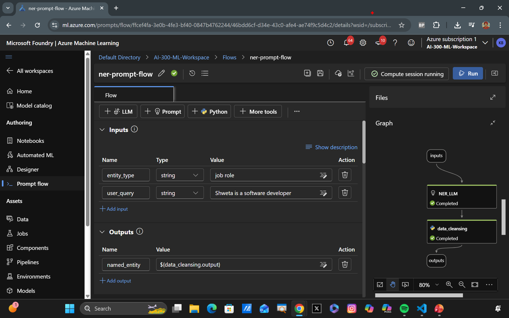

### Code Snippets for Named Entity Recognition Prompt Flow

NER_LLM prompt component:
```yaml
system:
Your task is to find entities of a certain type from the given text content.
If there're multiple entities, please return them all with comma separated, e.g. "entity1, entity2, entity3".
You should only return the entity list, nothing else.
If there's no such entity, please return "None".

user:
Entity type: {{entity_type}}
Text content: {{text}}
Entities:
```

data_cleansing python component:
```python
from typing import List
from promptflow import tool

@tool
def cleansing(entities_str: str) -> List[str]:
# Split, remove leading and trailing spaces/tabs/dots
parts = entities_str.split(",")
cleaned_parts = [part.strip(" \t.\"") for part in parts]
entities = [part for part in cleaned_parts if len(part) > 0]
return entities
```

Final Prompt Flow should look like this:

