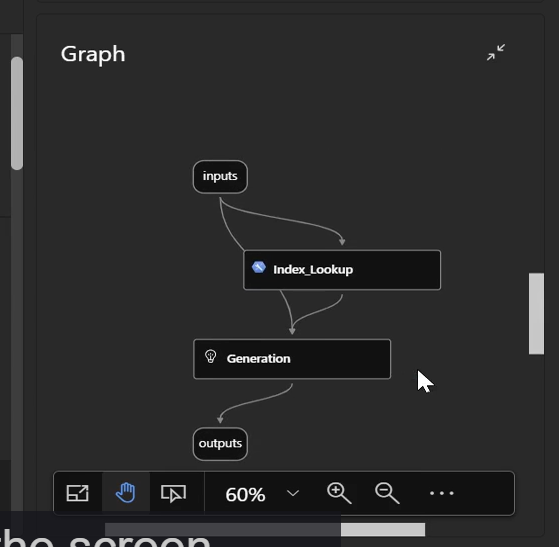

### RAG Pipeline with Prompt Flow

Generation LLM Component Prompt:
```yaml
system:
You are meant to behave as a RAG chatbot and you will be presented with some documents
from an azure ai search index. Your task is to answer the user query from the 
information in the context derived from the ai search index

user:
user_query: {{user_query}}
context: {{context}}
```

this is how the final RAG prompt flow should look like:
